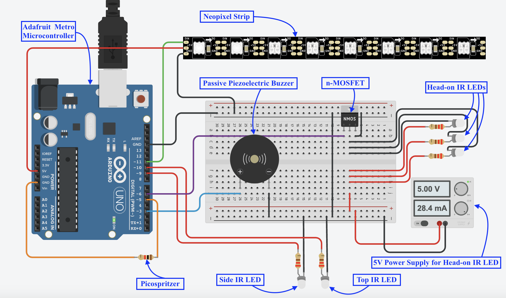
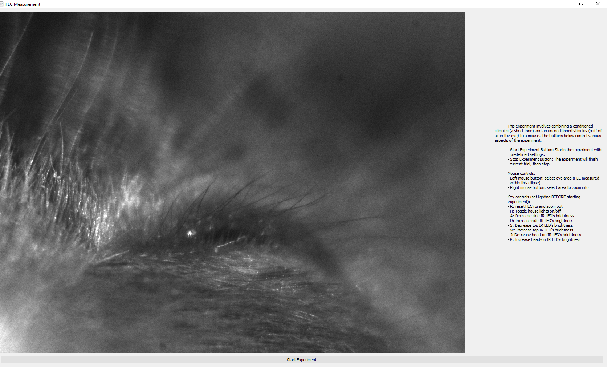

# Eyeblink Experiment

This repository contains code and instructions for setting up an eyeblink conditioning experiment in mice. In this case, the conditioned stimulus is a short musical tone, 
and the unconditioned stimulus is a short puff of air to the mouse's eye. An infrared camera records a live feed of the mouse's eye, sending each frame to a Python script
that calculates how open or closed the mouse's eye is every millisecond.

This page is a work in progress, and will be updated as the project progresses.

Author(s): Alvin Adjei, University of California San Francisco

## Requirements
### Hardware
- Designed to work on Windows 10 and newer. Untested on Mac.
- 1 $\times$
  <a href="https://store.arduino.cc/products/arduino-uno-rev3?srsltid=AfmBOophdIvm8RfX5799wr4zovlr1sxV1jH-H7QClWuCym0v6gZN2AgC">
    Arduino Uno
  </a>
  or similar microcontroller (we used an <a href="https://www.adafruit.com/product/2488">Adafruit Metro Board</a>)
- 1 $\times$ Picospritzer III or similar device that can accept Arduino HIGH as input signal and outputs an air puff
- 1 $\times$
  <a href="https://www.adafruit.com/product/1426">
    neopixel strip
  </a>
- 5 $\times$ infrared LEDs (the ones we used emit light w/ 850nm wavelength)
- 5 $\times$ 220 $\Omega$ resistors
- 1 $\times$ N-Channel MOSFET
- 1 $\times$ passive piezoeelectric buzzer
- 1 $\times$
  <a href="https://www.edmundoptics.com/p/allied-vision-alvium-1800-u-120m-13-12mp-c-mount-usb-31-monochrome-camera/48262/">
    Allied Vision Alvium 1800 U-120m Monochrome Camera</a>,
  or similar camera with ___no___ infrared filter and compatible lens (in this case, for a 1/3" sensor)
  - Camera drivers and software are <a href="https://www.alliedvision.com/en/products/software/" target="_blank">here</a>
  - Python API manual is <a href="https://docs.alliedvision.com/Vimba_X/Vimba_X_DeveloperGuide/pythonAPIManual.html">here</a>
- 1 $\times$ <a href="https://www.edmundoptics.com/p/m6-and--20-mounting-plate-for-alvium/42353/">M6 and ¼-20 Mounting Plate for Alvium</a>
- 1 $\times$ Infrared mirror
- Other materials shown in the image at the top come from Thorlabs

### Software
The code for this project is written in Python and in the Arduino IDE. The required Python libraries and their versions are specified in <code>requirements.txt</code>.
To install them, run <code>python -m pip install -r requirements.txt</code>
in the terminal in the project's root directory.

The Arduino code requires the Adafruit NeoPixel library, which can be installed via the Library Manager in the Arduino IDE.

To interface with the camera, install the <a href="https://www.alliedvision.com/en/products/software/vimba-x-sdk/">Vimba X SDK</a> and the
<a href="https://docs.alliedvision.com/Vimba_X/Vimba_X_DeveloperGuide/about.html#installation">USB driver</a>. Then,
follow the instructions found <a href="https://docs.alliedvision.com/Vimba_X/Vimba_X_DeveloperGuide/pythonAPIManual.html">here</a> to install
Vimba X's Python API, VmbPy.

## Assembly
<figure>
  
  <figcaption>
    Circuit diagram.
    

      <b>Note: The Adafruit NeoPixel library uses pin 11 as the default data output pin for Neopixels on Arduino boards. If using an Adafruit Metro board like we did, pin 6 is the default data output pin for the Neopixels. Make sure your circuit and code align with the board you are using by appropriately setting the <i>PIX_PIN</i> and <i>IR_LED_3</i> variables in <code>Code/capture/Arduino/serial_control/serial_control.ino</code> according to your hardware.
      </b>
    

    

      The resistor in the bottom left represents the Picospritzer. The "Side IR LED" and "Top IR LED" are attached
      to the left and top of the camera. The "Head-on IR LEDS" are attached to a post facing the mouse head-on.
    

  </figcaption>
</figure>

## Run Experiment

<ol>
  <li>Clone or download this repository.</li>
  <li>Plug USB camera and Arduino Uno into USB ports in the computer. The camera needs to be plugged into a USB 3 port, which is usually identified by having the color blue on the inside.</li>
  <li> Open <code>Code/capture/Arduino/serial_control/serial_control.ino</code>. This file contains instructions for the Arduino to execute when it receives serial instructions. Here, you can adjust constants like <code>csDuration</code> (how long the tone plays), <code>ISI</code> (inter-stimulus interval), and <code>usDuration</code> (how long the airpuff lasts) to your liking. Then, upload the code to the Arduino.</li>
  <li>Open <code>Code/capture/run_experiment.py</code></li>
  <li>Open the Device Manager on Windows to determine which USB port the camera is plugged into (e.g. 'COM4'), and set the <code>arduino_port</code>
  variable equal to this name (we have set this variable to <code>'COM4'</code> by default)</li>
  <li>
    Adjust global constants like <code>num_trials</code> (number of trials in an experiment) and <code>ITI</code> (inter-trial interval)
    to your liking.
  </li>
  <li>Navigate to the root directory of this project in the terminal, activate the <code>.venv-wind</code> virtual environment, then press the run button in your code editor to run the script.</li>
  <li>In the terminal, you will be prompted to enter the mouse's ID. Enter an ID of your choice and press Enter.</li>
  <li>Next, you will be asked if this is the first recording of the day for this mouse. If you enter 'y' for yes, you will continue to the next steps where you can run the experiment for <code>num_trials</code> iterations. If you enter 'n' for no, you will then be asked how many trials you would like to run on the mouse. Once you enter this, the following steps will be the same.</li>
  <li>
    Now, the GUI will open. If the window doesn't appear, check the app taskbar/dock for a new app running. The window should look something like this:
    

      
    

    

      On the left, you should see a live video feed from the USB camera. On the right, there are instructions on how to adjust the brightness of the
    infrared LEDs, zoom in to the image, and select the region of interest (ROI) containing the mouse's eye. Once an ROI has been selected, click 
    "Start Experiment" at the bottom to begin data acquisition.
    

  </li>
  <li>
    The experiment will run for the number of trials that you specified in <code>num_trials</code>. At any point, click the "Stop Experiment" button to
  terminate the experiment. If you terminate early, the data from the experiment up to that point will still be saved to CSV files.
  </li>
  <li>
    When the experiment is over, the data will be saved to two CSV files in the <code>Data/</code> directory. Each file will have the timestamp when it was
    saved in its name. The CSV saved to <code>Data/FEC/{mouse_id}/</code> has three columns: "Timestamp", "Trial #", and "FEC". It contains the timestamp, trial number, and
    fraction of eye closure, or FEC, in each frame. The CSV saved to <code>Data/stim/{mouse_id}/</code> has three columns: "Trial #", "CS Timestamp", and "Airpuff" containing the timestamp
    at which each trial's conditioned stimulus (in our case, the tone that plays before the airpuff) begins and whether an unconditioned stimulus (air puff) was executed during that trial.
  </li>
</ol>
